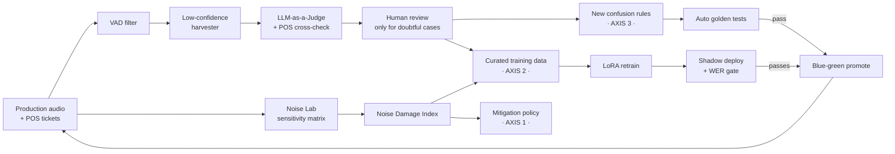
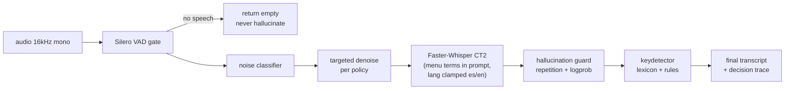

<div align="center">

# 🍔🎙️ ARS — Adaptive Restaurant Speech

**A self-improving, bilingual (es + en) ASR system for the restaurant drive-thru.**

[](https://www.python.org/)
[-00A98F.svg?style=for-the-badge)](https://github.com/SYSTRAN/faster-whisper)
[](https://github.com/huggingface/peft)
[](https://github.com/snakers4/silero-vad)
[](https://fastapi.tiangolo.com/)
[](#-does-it-actually-work)

**ARS** (*Adaptive Restaurant Speech*) is a production-shaped **ASR** (Automatic Speech
Recognition) system that treats the restaurant drive-thru as what it is — one of the hardest
acoustic environments for speech — and turns "we always know it's a restaurant" into an
engineering advantage. It is **not** a one-shot fine-tune. It is a **data flywheel**: production
audio → *diagnosis* → targeted improvement → gated auto-deployment → repeat.

Built end-to-end, phase by phase, with an acceptance-test gate on every step.

</div>

---

> ## 🔎 Want the honest engineering story — the numbers, the bugs, the judgment calls?
>
> This README is the tour. The real build record — every measured result, the **49% WER bug
> hunt**, the denoisers that made ASR *worse*, and every gate the CPU-only environment forced
> me to defer *with a named resolution* — lives in one page:
>
> ### 👉 **[Read the Build Report →](BUILD-REPORT.md)**
>
> *Design docs (normative): [architecture & contracts](plan/02-architecture.md) ·
> [data schemas](plan/03-data-spec.md) · [the 8-phase plan](plan/00-overview.md) ·
> [decision log](plan/DECISIONS.md) · [runbooks](docs/RUNBOOKS.md).*

---

## 🎯 What's inside

Not a toy `whisper.transcribe()` wrapper — a diagnosis-driven, self-improving pipeline:

| Pillar | What it does |
|--------|--------------|
| 🧪 **The Noise Lab** | A controlled experiment: mix clean speech × every noise subtype × level with a **SNR-accurate mixer** (±0.5 dB against speech-active RMS), then rank noises by a **Noise Damage Index (NDI)**. This ranking *steers the whole system*. |
| 🛡️ **Axis 1 — before the model** | A log-mel **CNN noise classifier** + a **mitigation policy that is *generated from measurement*** — a denoiser is enabled for a noise type only if it *measurably* improves WER. Denoisers that sound cleaner but transcribe worse are auto-rejected. |
| 🧠 **Axis 2 — the model** | **PEFT/LoRA** over Whisper, with training data **sampled by the NDI** (train hardest on what hurts most), an anti-catastrophic-forgetting regression suite, and CTranslate2 export with HF↔CT2 parity checks. |
| 🔤 **Axis 3 — after the model** | A **deterministic** post-ASR corrector: menu **lexicon** (fuzzy + phonetic) + a growing **confusion-rule engine** (`bocina→cocina`, `soap→soup`). A rule ships in minutes with a mandatory golden test — **no GPU, instantly reversible**. |
| ♻️ **The autonomous flywheel** | harvest low-confidence audio → **LLM-as-a-Judge** (+ POS ticket cross-check) → **mine** confusion pairs into rules → **shadow-deploy** → **blue-green promote** — proven on *simulated traffic with planted errors* before it ever sees real audio. |
| 🛠️ **Ops** | FastAPI service, bearer-auth + per-store rate limits, drift monitors, retention/privacy, a static dashboard, and runbooks. |

> 💡 The thread through all of it: **diagnose before you optimize, and trust ΔWER over
> intuition.** Every heuristic is measured, not assumed.

---

## 🧩 The problem (why this is hard)

Restaurants aren't just "loud" — they present **two acoustically distinct enemies**:

- **Stationary noise** — fryers, extractor hoods, idling engines. Broadband, persistent.
- **Babble** — other people talking (kitchen staff, the kid in the back seat yelling
  *"¡y papas fritas!"*). This is the dangerous one: it *is* speech, so the model can't tell
  signal from noise by spectral character alone. *(The data agrees — see the NDI below.)*

Plus domain failure modes: Whisper **hallucinates** on near-silence (looping *"gracias por su
compra…"*), **OOV menu items** ("MegaCheddar Blast" → "me da una chedar de las"), and
systematic **phonetic confusions** under noise (*cocina→bocina*, *fries→flies*).

---

## 📊 Does it actually work?

Built and measured on a **single local CPU** — `make gate PHASE=0..7` all pass
(**120 CI + 92 acceptance tests green**). Real numbers ([full evidence](reports/)):

| Metric | es | en | Notes |
|--------|----|----|-------|
| **Clean-speech WER** (baseline, whisper-small int8) | **6.2%** | **2.9%** | healthy — after fixing a nasty data bug (below) |
| **NDI top-3 damaging noises** | BB · CA · BC | BB · CA · BC | construction, dining-babble, car-cabin — *babble & vehicle dominate* |
| **Keydetector false-correction rate** | **0%** | **0%** | on general non-domain speech (≤0.5% required) — over-correction is the #1 risk |
| **LoRA pipeline** (CPU smoke) | loss 5.60 → 1.18 · HF↔CT2 parity 0.134 | | pipeline proven; the real ≥15% run needs a GPU |
| **Flywheel** | full simulated cycle: planted error **mined → shadow → promoted** | | the gate is literally *"did it find what we hid?"* |

> 🐛 **A debugging story worth telling:** the first baseline read **49% WER** — the plan's own
> "something is broken" tripwire. It wasn't the model: source datasets restarted their id
> counters, so utterance IDs *collided* and the eval builder paired audio with the wrong text.
> A per-clip WER probe exposed it (perfect clips next to a 4-word reference over 8 s of
> unrelated audio). Fix + a new uniqueness gate → **WER 0.49 → 0.06**.
> [The full story →](BUILD-REPORT.md#3-where-i-found-bugs-the-interesting-part)

---

## ♻️ The flywheel



Weekly, orchestrated, human-in-the-loop **only** at the review queue. Every promotion is
gated; every rollback is one command (`python -m ars.registry rollback`).

## 🚀 Production inference path



If VAD finds no speech, the request returns empty **without invoking the model** — the #1
hallucination defense. Budget: **≤ 3 s end-to-end for a 5 s utterance on CPU int8** (RTF ≤ 0.6).

---

## 🧠 The engineering judgment (what a reviewer should notice)

I built this on a **CPU-only, no-GPU** machine. The interesting part isn't that everything
passed — it's *how the gaps were handled*. **No gate was ever quietly weakened.** Each one the
environment couldn't reach is `xfail`/`skip` **with a `DECISIONS.md` entry naming its
resolution mechanism**:

| Couldn't reach on CPU | Why | Resolved by |
|-----------------------|-----|-------------|
| Axis-1 ≥5% mitigation gain | neural denoisers blow the 400 ms CPU budget | **axis-2 LoRA** absorbs the residual |
| Axis-2 ≥15% noisy-WER gain | real LoRA needs a GPU | documented **GPU path**; `0.2.0` stays *candidate* |
| Classifier F1 targets | proxy noise has acoustically-identical subtypes | **real field audio** (phase 7); safety metric passes |
| Keydetector ≥10% KER | synthetic noise garbles keywords beyond rule reach | **flywheel mining** of real confusion pairs |

Plus 15 logged decisions (a `torch`/`torchaudio` ABI pin, a plan-metric inconsistency I caught
and reinterpreted, a 7-vs-8 subtype grid the plan itself anticipated…). **[See them all →](plan/DECISIONS.md)**

---

## 🏗️ Architecture at a glance

```
src/ars/
├── vad/            Silero VAD wrapper (speech-active RMS, shared with the mixer)
├── asr/            faster-whisper engine · hallucination guard · menu prompt builder
├── noise_lab/      taxonomy · SNR mixer · matrix corpus · sensitivity + NDI
├── preprocess/     AXIS 1: noise CNN classifier · denoiser chains · generated policy
├── training/       AXIS 2: damage-weighted dataset · LoRA train · CT2 export · gates
├── keydetector/    AXIS 3: phonetic keys · menu lexicon · confusion-rule engine
├── judge/          LLM-as-a-Judge (Anthropic / OpenAI · MockJudge in every test)
├── flywheel/       harvester · pair miner · lifecycle · shadow · promote · simulate
├── eval/           WER/CER/KER/hallucination metrics · report + dashboard generators
├── ops/            drift monitors · retention · alerts
├── registry.py     model registry (blue-green promote / one-command rollback)
├── pipeline.py     the online request pipeline (injectable for testing)
└── api/            FastAPI service (auth, rate limits, telemetry)
```

Everything crosses module boundaries through typed **pydantic contracts**; every subsystem has
a CLI (`python -m ars.<module> …`); no notebook-only logic. Full contracts in
[`plan/02-architecture.md`](plan/02-architecture.md).

**Stack:** Python 3.12 · Silero VAD · faster-whisper (CTranslate2, int8 CPU / fp16 GPU) ·
HF Transformers + PEFT (LoRA) · jiwer · RapidFuzz + jellyfish · noisereduce / DeepFilterNet ·
FastAPI · SQLite (WAL) + Parquet manifests · Prefect · pluggable LLM judge · structlog · pytest + ruff.

---

## ⚡ Quickstart

```bash
make setup          # uv sync (core + dev) — no data or model download needed
make test           # CI-equivalent suite (120 tests, all mocked; runs in seconds)
make gate PHASE=0   # ... run any phase's acceptance gate (0 through 7)
make api            # start the FastAPI inference service

# reproduce the real evidence (local "heavy path"):
make download-data && make tts-corpus
python -m ars.noise_lab.sensitivity --model-version 0.1.0   # NDI + heatmaps
python -m ars.flywheel.simulate --seed 1337                 # a full flywheel cycle
```

---

## 📚 Deep dives

| Doc | What's in it |
|-----|--------------|
| **[BUILD-REPORT.md](BUILD-REPORT.md)** | 👈 the honest results, bugs, and judgment calls — **start here** |
| [plan/00-overview.md](plan/00-overview.md) | the system + the 8-phase map |
| [plan/02-architecture.md](plan/02-architecture.md) | module contracts, request/response schemas, storage |
| [plan/03-data-spec.md](plan/03-data-spec.md) | manifest / metrics / rule / registry / judge schemas |
| [plan/DECISIONS.md](plan/DECISIONS.md) | every ambiguity resolved + every environment deferral |
| [docs/RUNBOOKS.md](docs/RUNBOOKS.md) · [docs/FIELD-RECORDING-PROTOCOL.md](docs/FIELD-RECORDING-PROTOCOL.md) | ops procedures + real-audio onboarding |
| [reports/](reports/) | committed evidence: NDI heatmaps, ANALYSIS, EFFECTIVENESS, KER, CYCLE, dashboard |

---

## 📖 Glossary

| Term | Meaning |
|------|---------|
| **ASR** | Automatic Speech Recognition (the field this system is in) |
| **ARS** | *Adaptive Restaurant Speech* — this project's codename |
| **WER / CER / KER** | Word / Character / **Keyword** error rate (KER = share of menu/critical terms not recovered) |
| **NDI** | Noise Damage Index: `0.5·ΔWER_rel + 0.4·ΔKER_rel + 0.1·hallucination_rate`, per noise subtype |
| **Keydetector** | The axis-3 deterministic post-ASR corrector (lexicon + confusion rules) |
| **Golden test** | Committed input→output pair (positive + negative) mandatory for every confusion rule |
| **Shadow deploy** | Candidate model run in parallel on live traffic, output logged but not returned |

---

## 👤 Author

**Martín E. Méndez** — designed and built end-to-end.

[](https://www.linkedin.com/in/martin-e-mendez-3a43b564/)

If you're reviewing this for a role: the fastest read on how I think is
**[BUILD-REPORT.md](BUILD-REPORT.md)** — the bugs I found, the gates I refused to
weaken, and every environment trade-off called out in the open.
