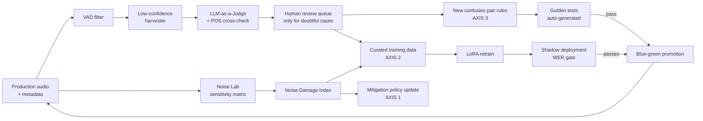
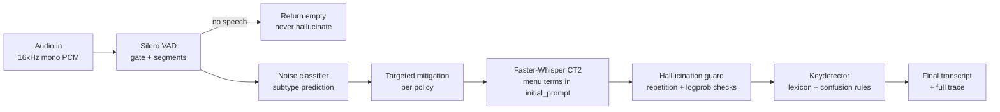

# 00 — System Overview

> Read this first. Then read [01-conventions.md](01-conventions.md) before writing any code.

## What ARS is

**ARS (Adaptive Restaurant Speech)** is a self-improving, bilingual (Spanish + English) speech-to-text system specialized for restaurant environments (drive-thru lanes, counters, kitchens). It is built for a **drive-thru voice automation company** targeting the **USA + LATAM** markets — hence the bilingual scope and the multi-accent Spanish coverage requirement. The primary deployment channel is the **drive-thru lane**, so outdoor/vehicle noise (taxonomy family B, including in-car passenger voices) is a first-class concern. It is **not** a one-shot model-training project: it is a **Data Flywheel** — a continuous pipeline where production audio feeds diagnosis, diagnosis feeds targeted improvements, and improvements are validated and promoted automatically.

The core insight: we **always know the domain is a restaurant**. That prior is exploited everywhere — vocabulary biasing, noise profiles, phonetic-confusion correction — not just in model training.

## The three axes of self-improvement

Every improvement cycle works on three axes simultaneously. Each axis is an independent subsystem with its own metrics, tests, and promotion gates:

| Axis | Where | Subsystem | What it does |
|------|-------|-----------|--------------|
| **1** | Before the model | `preprocess` | Detects *which* noise type is present in the incoming audio (noise classifier) and applies a **targeted** mitigation chain (spectral gating, neural denoising, source separation) chosen per noise type. Policies are generated from measured effectiveness, never hand-tuned. |
| **2** | The model itself | `training` | PEFT/LoRA adapters over a Whisper base model. Training data is synthetically noised, with sampling **weighted by the Noise Damage Index** (see below) so the model trains hardest on the noises that hurt it most. Guarded by anti-catastrophic-forgetting regression suites. |
| **3** | After the model | `keydetector` | A post-ASR correction engine: menu lexicon (fuzzy + phonetic matching) plus a growing database of **phonetic confusion pair rules** ("bocina"→"cocina", "soap"→"soup"). Mined errors become replacement rules, **not** training data. Deterministic, testable, instantly deployable. |

Axis 3 is deliberately separate from axis 2: a confusion rule ships in minutes with a golden test; a fine-tune ships in days with a full evaluation. Both consume the same mined errors.

## The Noise Lab (the diagnostic engine)

The centerpiece addition over a plain ASR pipeline. It answers: **"which specific noise, at which level, damages performance the most?"**

1. A **noise taxonomy** classifies every noise asset: family (kitchen / outdoor / front-of-house / music) → subtype (`AA` dishes, `AB` fryer, `AC` kitchen babble, `BA` drive-thru traffic, `BB` construction, ...) → level (`05` / `10` / `15`, mapped to SNR +10 / 0 / −5 dB, where level `10` means noise RMS equal to the clean speech RMS).
2. A **deterministic SNR mixer** crosses clean utterances × noise subtypes × levels into an evaluation matrix corpus (e.g. `cl-0042__noise-AB-15.wav`).
3. A **sensitivity run** evaluates any model version over the full matrix and produces, per cell: WER, CER, KER (keyword error rate over domain terms), and hallucination rate.
4. The output is the **Noise Damage Index (NDI)** ranking — a per-subtype damage score. This ranking *drives* the flywheel: axis 1 builds mitigations for the top offenders, axis 2 oversamples them during training, axis 3 mines the confusion pairs they cause.

## The flywheel loop

Weekly cadence, fully orchestrated (Prefect), human-in-the-loop only at the review queue. Every promotion is gated by automated regression tests; every rollback is one command.

## Inference pipeline (production request path)

Every stage logs its decision (noise predicted, mitigation applied, rules fired) so the flywheel can learn from production traces.

## Phases at a glance

| Phase | Name | Delivers | Gate (summary) |
|-------|------|----------|----------------|
| 0 | [Foundations](phases/phase-0-foundations.md) | Repo, tooling, Docker, dataset downloads, CI | All unit tests green, datasets manifested |
| 1 | [Baseline ASR](phases/phase-1-baseline-asr.md) | VAD + Faster-Whisper service, eval harness, telemetry | Baseline WER reports (es+en), anti-hallucination tests |
| 2 | [Noise Lab](phases/phase-2-noise-lab.md) | Taxonomy, noise bank, SNR mixer, sensitivity matrix, NDI | Full-matrix sensitivity report for baseline model |
| 3 | [Axis 1 — Preprocessing](phases/phase-3-axis1-preprocessing.md) | Noise classifier, mitigation registry, auto-generated policy | Measured WER improvement on top-damage cells; zero harm on clean audio |
| 4 | [Axis 2 — LoRA](phases/phase-4-axis2-lora.md) | Damage-weighted training, LoRA adapters, CT2 export, regression suite | ≥15% relative WER improvement on noisy eval, both languages, no clean regression |
| 5 | [Axis 3 — Keydetector](phases/phase-5-axis3-keydetector.md) | Menu lexicon, confusion rule engine, golden test framework | KER improvement, false-correction rate ≤ 0.5% |
| 6 | [Flywheel](phases/phase-6-flywheel.md) | Orchestration, LLM-judge, pair mining, shadow deploy, model registry | One full simulated cycle end-to-end, automated |
| 7 | [Hardening & Ops](phases/phase-7-hardening-ops.md) | Store noise profiles, drift alarms, dashboards, runbooks, real-data onboarding protocol | Ops checklist complete |

Phases are strictly sequential. A phase is **done** only when its exit checklist passes (see each phase doc). Progress is tracked in [STATUS.md](STATUS.md).

## Document map

| Doc | Purpose |
|-----|---------|
| [01-conventions.md](01-conventions.md) | Naming, taxonomy codes, SNR mapping, directory layout, config rules. **Normative.** |
| [02-architecture.md](02-architecture.md) | Components, module contracts, request/response schemas, storage layout |
| [03-data-spec.md](03-data-spec.md) | Machine-readable schemas: manifests, metrics, rules, registry, judge contract |
| [phases/](phases/) | One doc per phase: tasks, acceptance tests, exit checklist |
| [testing/test-strategy.md](testing/test-strategy.md) | Test pyramid, fixture policy, markers, CI vs local gates |
| [STATUS.md](STATUS.md) | Live progress tracker (builder updates it) |
| [DECISIONS.md](DECISIONS.md) | Decision log for ambiguities resolved during the build |
