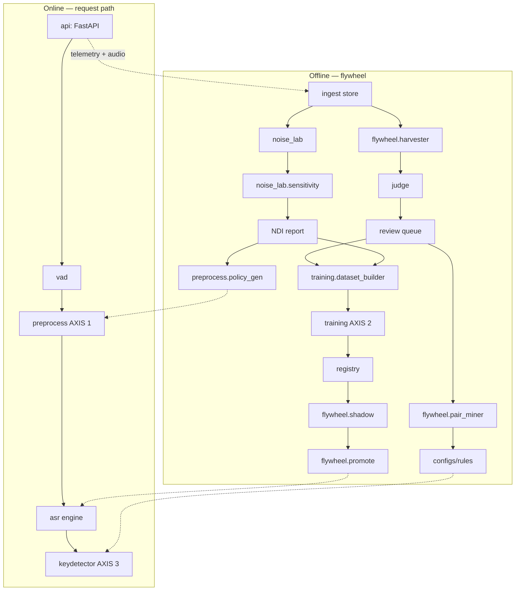

# 02 — Architecture & Module Contracts

Components communicate only through the typed contracts below (pydantic models in `src/ars/contracts.py` — one module, imported everywhere). A phase may stub a downstream component but must honor its contract.

## 1. Component graph



## 2. Core contracts (`src/ars/contracts.py`)

```python
class AudioRecord(BaseModel):
    utterance_id: str
    path: str                    # storage-relative
    sample_rate: int             # always 16000 after ingest
    duration_s: float
    store_id: str | None
    captured_at: datetime | None
    meta: dict[str, Any] = {}    # mic gain, POS order id, daypart...

class VadResult(BaseModel):
    segments: list[tuple[float, float]]   # seconds
    speech_ratio: float                   # 0..1
    speech_rms: float                     # RMS over active frames

class PreprocessReport(BaseModel):
    noise_pred: str | None       # subtype code, e.g. "AB"; None = clean
    noise_confidence: float
    chain_applied: list[str]     # e.g. ["deepfilternet"] or []
    latency_ms: float

class RawTranscript(BaseModel):
    text: str
    language: str                # "es" | "en"
    segments: list[Segment]      # start, end, text, avg_logprob, no_speech_prob
    avg_logprob: float
    guard_flags: list[str]       # e.g. ["repetition_truncated", "low_speech_gated"]

class Correction(BaseModel):
    rule_id: str                 # confusion rule id or "lexicon"
    span: tuple[int, int]        # char offsets in raw text
    before: str
    after: str
    confidence: float

class FinalTranscript(BaseModel):
    text: str
    raw_text: str
    language: str
    corrections: list[Correction]
    trace: TranscribeTrace       # vad + preprocess + asr + keydetector timings/decisions
```

## 3. API service

`POST /v1/transcribe` — multipart WAV or JSON `{audio_b64, store_id, meta}` → `FinalTranscript` (JSON). Also: `GET /healthz`, `GET /v1/model` (current registry entry), `GET /metrics` (rolling latency/confidence stats).

Behavioral requirements:

- If `speech_ratio < settings.vad.min_speech_ratio` (default 0.2): return empty `text` with `guard_flags=["low_speech_gated"]`. **Never** send near-silent audio to Whisper (hallucination source #1).
- `initial_prompt` is built per request by `asr.prompt_builder` from the store's menu (top terms, ≤ 200 tokens — Whisper truncates prompts at 224).
- Keydetector runs in `mode: replace | log_only` (config). In `log_only`, corrections are recorded in the trace but `text == raw_text`.
- Every request appends one JSONL telemetry line and (if `settings.ingest.store_audio`) persists the raw audio + sidecar for the flywheel.

## 4. ASR engine specifics

- Backend: `faster-whisper` (CTranslate2), `compute_type=int8` on CPU, `float16` on GPU.
- Decoding defaults: `beam_size=5`, `condition_on_previous_text=False`, `no_speech_threshold=0.6`, `log_prob_threshold=-1.0`, `temperature=[0.0, 0.2, 0.4]`.
- Hallucination guard (post-decode, `asr/guard.py`): (a) drop segments with `no_speech_prob > 0.85` and `avg_logprob < -1.0`; (b) if any 3-gram repeats ≥ 3 times consecutively, truncate at first repetition and flag; (c) if VAD said no speech in a segment's time span, drop it.

## 5. Storage & operational DB

- `ars.storage.Storage` abstraction: `LocalStorage` (phase 0) and `S3Storage` (MinIO, same interface). All paths storage-relative.
- SQLite `data/db/ars.db` (WAL mode), tables: `utterances`, `transcriptions` (one row per model version per utterance), `corrections`, `judge_verdicts`, `metric_runs`, `review_queue`. Schemas in [03-data-spec.md](03-data-spec.md). Dataset manifests are Parquet files, not DB rows.

## 6. Registries

- **Model registry** — `models/registry.json`: list of entries (schema in 03), exactly one with `stage: "production"`, at most one `"shadow"`. Promotion/rollback = atomic rewrite of this file by `flywheel.promote`.
- **Rules registry** — `configs/rules/rules-{lang}.yaml`: confusion rules with lifecycle `candidate → approved → active → retired`. Only `active` rules fire in `replace` mode; `approved` fire in `log_only`. The keydetector loads them at startup and on SIGHUP.

## 7. Latency budget (production request, 5 s utterance, CPU int8, whisper-small)

| Stage | Budget |
|-------|--------|
| VAD | ≤ 50 ms |
| Noise classify | ≤ 80 ms |
| Mitigation chain | ≤ 400 ms |
| ASR decode | ≤ 2500 ms |
| Keydetector | ≤ 20 ms |
| **End-to-end** | **≤ 3 s** (RTF ≤ 0.6) |

Budgets are asserted by `slow`-marked latency tests (local only, not CI).
